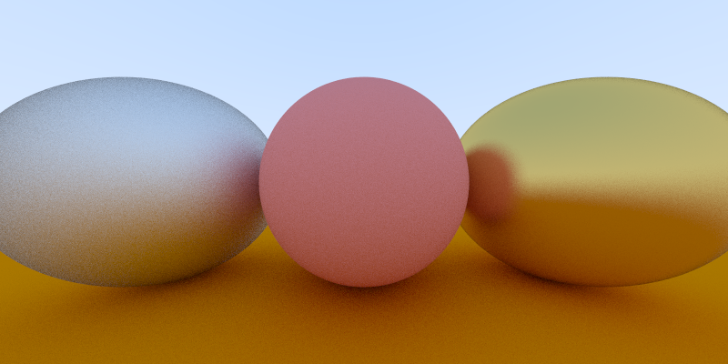
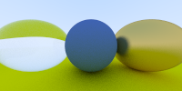
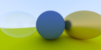
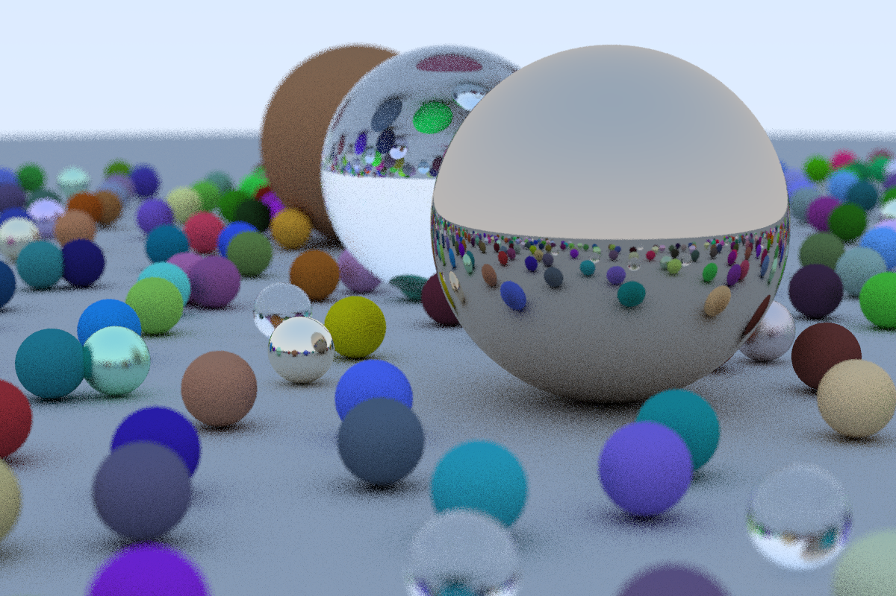

# SimpleRT
**Simple Ray Tracer in C++**

### **Build and Run**
#### Build
`g++ main.cpp -o main`

#### Generate image file result.ppm
`main.exe > result.ppm`

#### Generate image file result.ppm with _width_ _height_ and _samples_
`main.exe [width] [height] [samples] > result.ppm`

##### Generate 1200x800 image with 10 samples
`main.exe 1200 800 10 > result.ppm`

### **Results**

#### 1. Metal

#### 2. Glass

#### 3. Bubble

#### 4. Random Scene

